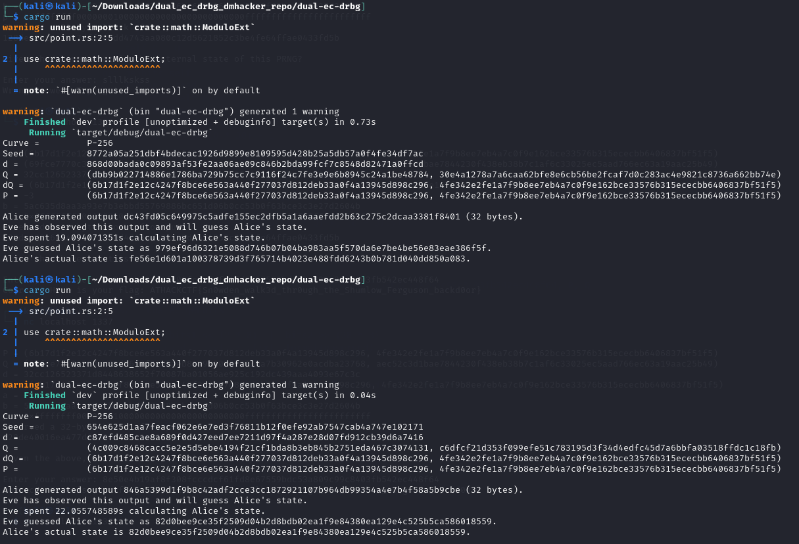
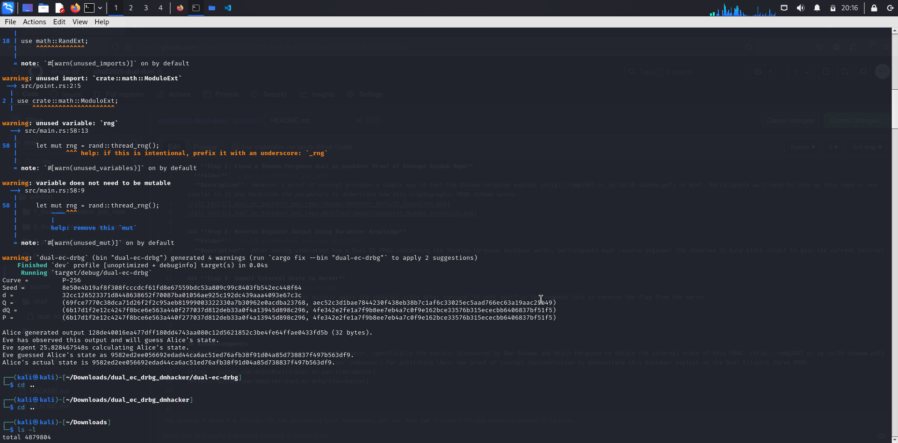
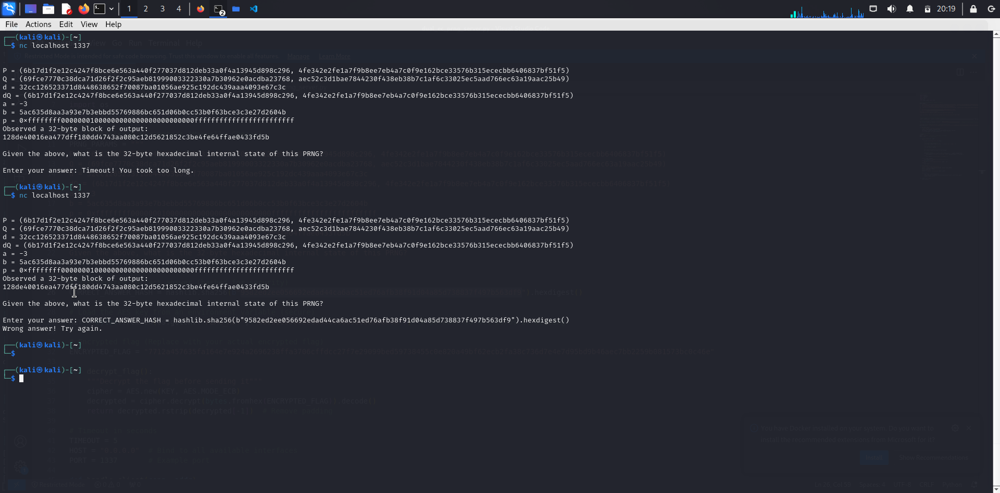

### **Step 1: Clone a Shumow-Ferguson dual_ec_backdoor Proof of Concept GitHub Repo**
- **Folder**: `1_dual_ec_backdoor_poc_repo`
- **Description**: dmhacker's proof of concept provides a simple way to test the Shumow-Ferguson exploit (http://rump2007.cr.yp.to/15-shumow.pdf) in Rust. Participants will need to look up this repo or one similar to it and hard-code the parameters to understand how this cryptographic PRNG scheme works.

### **Step 2: Reverse Engineer Output Using Parameter Knowledge**
- **Folder**: `2_dual_ec_backdoor_poc_repo_modified`
- **Description**: After having understood how a Dual EC PRNG containing the Shumow-Ferguson backdoor works, participants must reverse engineer the observed 32-byte block output to gain the current internal state of the PRNG.

### **Step 3: Submit Internal State to Server**
- **Folder**: `3_paste_internal_state_in_cmd`
- **Description**: Participants must quickly paste the internal state after running "nc host port" in the command line to receive the flag from the server.

---

## Acknowledgments
90 Dual Elliptic Curve Pseudo-Random Number Generator, specifically the exploit discovered by Dan Shumow and Niels Ferguson to obtain the internal state of this PRNG. (http://rump2007.cr.yp.to/15-shumow.pdf)
Special thanks to Anton Kueltz and David Hacker (dmhacker) for publishing their own proof of concept implementation to demonstrate this backdoor exploit on the Dual Elliptic Curve PRNG.
(https://github.com/AntonKueltz/dual-ec-poc/tree/master)
(https://github.com/dmhacker/dual-ec-drbg/tree/master)

---

**Prepared by:** Serban Alin Caia
**Date:** 2025/02/18
