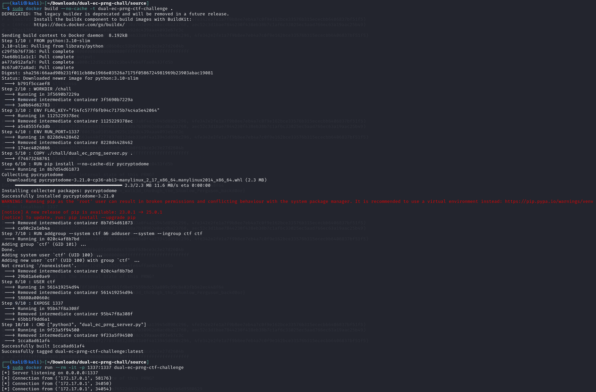
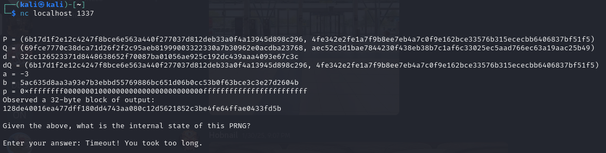
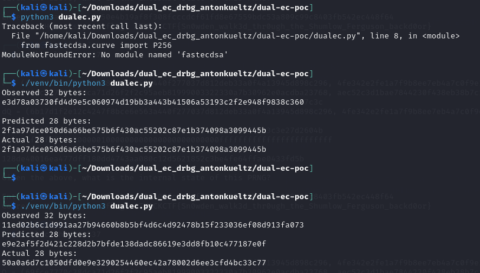
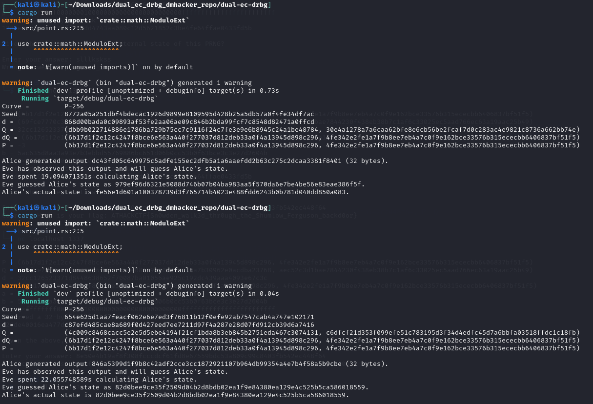

Simply build the Dockerfile and run the Docker container to run the dual_ec_prng_server.py file.

The server will wait for participants to execute "nc host port", after which it will transmit the relevant parameters needed to attempt the Shumlow-Ferguson exploit.
The server waits 5 seconds for input (i.e. the actual internal state of the Dual Elliptic Curve PRNG) before cutting the current client-server connection. 
Since the parameters are hard-coded for this challenge, participants can run the netcat command once to take note of the parameters and then solve it offline before running it again to submit their answer.

Please refer to Anton Kueltz or David Hacker's dual_ec_drbg proof of concepts to understand how to obtain the parameters (https://github.com/AntonKueltz/dual-ec-poc/tree/master & https://github.com/dmhacker/dual-ec-drbg/tree/master).
Simply run one of their implementations to see the random values obtained for each parameter and use those values for the ctf, but more importantly, save the actual internal state value that their implementations will output. That internal state value will be the answer the server must receive from participants to yield the flag.

---

## Acknowledgments
This CTF challenge was inspired by the vulnerability of the NIST SP800-90 Dual Elliptic Curve Pseudo-Random Number Generator, specifically the exploit discovered by Dan Shumlow and Niels Ferguson to obtain the internal state of this PRNG. (http://rump2007.cr.yp.to/15-shumow.pdf)
Special thanks to Anton Kueltz and David Hacker (dmhacker) for publishing their own proof of concept implementation to demonstrate this backdoor exploit on the Dual Elliptic Curve PRNG.
(https://github.com/AntonKueltz/dual-ec-poc/tree/master)
(https://github.com/dmhacker/dual-ec-drbg/tree/master)

---

**Prepared by:** Serban Alin Caia
**Date:** 2025/02/18
